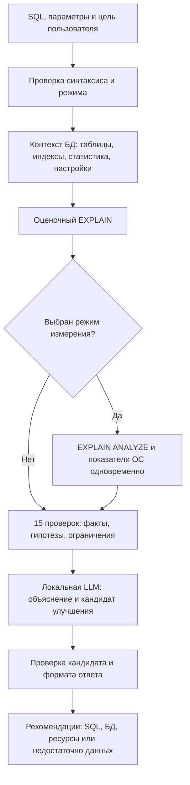

# QueryLens: подключение сборщиков и дальнейшая работа

## Первый эксперимент: ветка feature/local-collectors

В этой ветке работают Config Analyzer и Hardware Analyzer. Они собирают факты;
план введённого SQL получается через EXPLAIN; локальная LLM ещё не реализована. Ввод пароля нужен только
для локального соединения PostgreSQL, пароль не записывается в отчёт и настройки.
Он остаётся в памяти программы для повторного сбора до закрытия/переподключения.

### Как попробовать на MacBook

1. Активировать `.venv` и установить `python -m pip install -r requirements.txt`.
2. Запустить `python main.py`.
3. Открыть «Ресурсы», выбрать показатели и интервал обновления.
4. Нажать «Начать мониторинг»: появятся живые графики CPU, RAM и дисковых счётчиков,
   а также консоль измерений. Сбор продолжается до остановки. База не требуется.
5. Подключить локальную PostgreSQL: сервер `127.0.0.1`, порт `5432`, база `demo`,
   роль своей установки. Пароль вводится в диалоге. Пустой допустим, если так
   настроена аутентификация; программа её не обходит.
6. На странице «Анализ БД» выбрать конфигурацию и/или метаданные, нажать «Собрать показатели». Проверить настройки с пояснениями,
   структуру таблиц, число индексов и накопленную статистику.
7. Проверить отмену, повторный запуск, неправильные учётные данные и закрытие
   окна во время измерения. Сбор отчёта не добавляет запись в историю SQL.

На Windows те же действия интерфейса; активация окружения PowerShell:
`.\.venv\Scripts\Activate.ps1`. Отдельно нужно проверить доступность дисковых
счётчиков: отсутствие показываем как «недоступно», а не как нулевую активность.
Установка зависимостей — этап разработки; установщик клиента должен включать их
заранее и не требовать доступа к интернету.

## Какие файлы и функции за что отвечают

| Файл / функция | Задача и смысл |
|---|---|
| `app/database/connection.py`, `connect_postgresql()` | Проверяет локальный адрес и открывает read-only соединение с таймаутом; адрес закреплён через hostaddr, DNS не требуется. |
| `app/collectors/postgres.py`, `collect_postgres()` | Адаптер прежнего отчёта: объединяет отдельные сборщики configuration и metadata. |
| `app/collectors/configuration.py`, `collect_configuration()` | Читает настройки pg_settings текущей диагностической сессии. |
| `app/collectors/metadata.py`, `collect_metadata()` | Читает версию, статистику всей БД и каталоги таблиц/индексов. |
| `app/collectors/explain.py`, `collect_explain()` | Получает JSON-план без ANALYZE по кнопке «Анализировать» через AnalysisWorker и AnalysisService. |
| `app/collectors/statements.py`, `collect_statements()` | Читает pg_stat_statements по известному queryid текущей базы; пока не вызывается из UI. |
| `app/services/collection_service.py`, `collect_features()` | Независимо собирает пять источников по схеме анализа; возвращает данные и статус каждого. |
| `app/collectors/system.py`, `collect_system()` | Через psutil получает ядра, RAM и пять снимков CPU/RAM/swap/I/O ОС. platform сообщает ОС и архитектуру. |
| `io_rates()` | Разность накопленных дисковых счётчиков делит на реальный интервал time.monotonic(); это активность, не предельная скорость диска. |
| `app/services/collection_service.py`, `collect_report()` | Запускает выбранные модули; ошибка одного не скрывает результат другого. В результат не включает параметры подключения. |
| `app/workers/collection_worker.py`, `CollectionWorker.run()` | QThread выполняет сбор вне интерфейса; сигнал report_ready передаёт результат главному потоку. |
| `app/services/report_formatter.py`, `format_report()` | Показывает исходные единицы, понятные размеры и пояснения; не выдумывает диагноз. |
| `CollectionController.start()` | Проверяет возможность запуска и управляет worker; окно передаёт выбор пользователя и отображает сигналы результата. |
| `DatabasePanel.show_report()` | Показывает структуру и отчёт в памяти; пользователь может выделить и скопировать текст. |

Библиотеки: PySide6 — интерфейс и потоки, psycopg — PostgreSQL, psutil — ОС.
platform/time/datetime — стандартная библиотека Python. Сборщики не читают
пользовательские файлы, не используют облачную модель и не выполняют SQL редактора.
Настройки относятся к диагностической сессии: приложение другого пользователя
или с SET-переопределениями может иметь другие значения.

## Схема будущего анализа одного запроса

EXPLAIN ANALYZE выполняет запрос. Нужны отдельный явный режим пользователя,
ограничение времени и отмена. Read-only не заменяет проверку функций и CTE:
для MVP поддерживаем один допустимый SELECT с проверкой синтаксического дерева.
LLM работает после измерения, чтобы не создавать дополнительную нагрузку CPU.

## Что конкретно делать дальше

| Этап | Работа | Критерий результата |
|---|---|---|
| 1. Проверить текущую ветку | Запуск на MacBook и Windows, настройки, ошибки и отмена | Читаемый локальный отчёт без зависания; недоступные метрики явно отмечены. |
| 2. Добавить контекст SQL | Синтаксическое дерево, параметры, таблицы, типы, PK/FK/UNIQUE, индексы и статистика | Метаданные только нужных объектов; программа знает, какие столбцы и связи действительно существуют. |
| 3. Добавить планы | EXPLAIN JSON; отдельный управляемый EXPLAIN ANALYZE; сбор ОС во время SQL | Узлы, строки, loops, буферы, сортировки/temp и длительность связаны с измерением. |
| 4. Реализовать 15 сценариев | 12 пунктов таблицы курсовой + CTE, оконные функции, JOIN; проблемные примеры и контрпримеры | Конструкция сама по себе не считается ошибкой; у вывода есть доказательства и условия. |
| 5. Подготовить набор примеров | SQL + данные/индексы/настройки + планы + объяснение + кандидат + проверка результата | Есть независимый тестовый набор, исключено смешивание близких вариантов между обучением и оценкой. |
| 6. Подключить локальную модель | Сначала готовая модель и структурированный контекст; измерить качество и ресурсы | Рекомендации связаны с фактами; выдуманные индексы/таблицы и неподдержанные выводы отклоняются. |
| 7. Решить вопрос дообучения | Сравнить готовую модель с примерами в контексте и дообученным вариантом при достаточном наборе | Усложнение оправдано улучшением на отложенных сценариях, а не запоминанием 15 запросов. |
| 8. Собрать продукт | Отдельные установщики macOS/Windows с весами; автономная установка и контроль исходящих соединений | Клиент работает без интернета; SQL, пароли и отчёты не отправляются разработчику. |

## Как готовить LLM к вашим 15 сценариям

Не использовать всего 15 пар «неправильный — правильный». Для каждого сценария
нужны разные объёмы, распределения, индексы и ограничения, а также корректные
случаи с той же конструкцией. Набор должен содержать и ответы «улучшение не
подтверждено» / «не хватает данных». SELECT * не всегда избыточен; JOIN и окна
могут быть необходимы. N+1 требует истории вызовов приложения, а не одного SQL.

Для начала использовать готовую локальную модель с фактами и несколькими
проверенными примерами в контексте: это не обучение весов. После оценки решать,
нужно ли дообучение. Исследовательские примеры создаём на своей тестовой базе;
пользовательские SQL не отправляем для обучения. При дообучении разделяем данные
по сценариям/схемам, избегая близких дублей, и оцениваем ложные рекомендации,
корректность результата, подтверждённое ускорение и время ответа модели.

## Формат рекомендации

Факт → возможная причина → подтверждение → действие → проверка.

Например: «Sort записал временные данные на диск; вход большой. Рассмотреть
сокращение входа, подходящий индекс или изменение work_mem в тестовой сессии».
Одно значение work_mem не доказывает нехватку памяти. RAM и CPU всего компьютера
не принадлежат одному запросу. При Docker/VM измеренные ресурсы хоста отличаются
от лимитов базы; локальный адрес сам по себе этого не устраняет.

Итог может предложить изменение SQL, индекс/статистику/обслуживание, конфигурацию
БД или проверку конкурирующей нагрузки и ресурсов ОС. Автоматически менять
конфигурацию, создавать индексы или выполнять кандидат программа не должна.
Вывод «по доступным проверкам улучшения не выявлены» точнее, чем обещание полной
оптимальности. Кандидат SQL без подтверждения маркируется как непроверенный.

## Источники для планов и статистики

- https://www.postgresql.org/docs/18/sql-explain.html
- https://www.postgresql.org/docs/18/pgstatstatements.html

Ограничение локальных адресов покрывает соединение PostgreSQL этой программы,
но не является полной изоляцией ОС. Для готового офлайн продукта проверяем также
зависимости, локальную модель, отсутствие автозагрузок/телеметрии и трафик.
